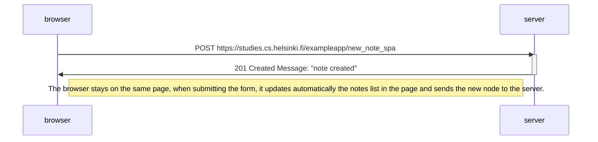

```mermaid

sequenceDiagram
  participant browser
  participant server

  browser->>server: POST https://studies.cs.helsinki.fi/exampleapp/new_note_spa
  activate server
  server->>browser: 201 Created Message: "note created"
  deactivate server

  Note right of browser: The browser stays on the same page, when submitting the form, it updates automatically the notes list in the page and sends the new node to the server.

```